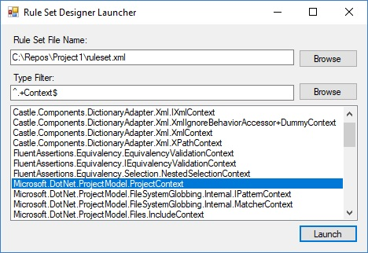
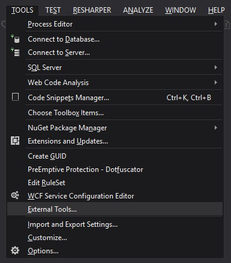
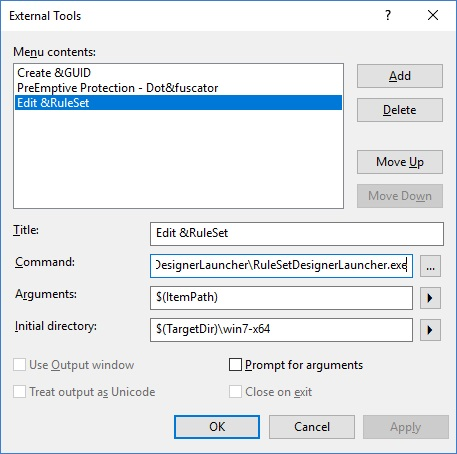

# RuleSetDesigner
A resizable Windows Workflow Designer Dialog

## Getting the Rule Set Designer Launcher
Download the latest [release](releases), and extract the files to any folder.

## How to use the Rule Set Designer Launcher


1. Set the **Rule Set File Name** to be the full path to a ruleset XML file you want to create or edit.
   1. You can use the **Browse** button to the right of the **Rule Set File Name** textbox to set the value.
1. Select the activity type (I call it a rule set context type) to validate the ruleset against from the list box.
   1. You can filter the list by entering a regular expression in the **Type Filter** textbox.
      1. You can set the default **Type Filter** textbox value in the RuleSetDesignerLauncher.exe.config file.
   1. You can change the folder where assemblies are scanned for types by clicking the **Browse** button to the right of the **Type Filter** textbox.
1. Click **Launch**.
1. When you are done editing the rule set, click **Save & Close** or **Close**. You will return to the Rule Set Designer Launcher.
1. You can continue to repeat the above steps to edit different rule sets or validate against different activity types, or you can exit the Rule Set Designer Launcher by click on the **X** in the top right corner.

## Launching the Rule Set Designer from Visual Studio
In Visual Studio, open the tools menu and click **External Tools...**



In the External Tools dialog, click **Add**. 
Enter the full path to the unzipped RuleSetDesignerLauncher.exe in the **Command** textbox. 
Enter the path you want to initially scan assemblies for activity types in the **Initial directory** textbox. 
Enter the full path you want to set for the initial ruleset file name in the **Arguments** textbox. 
Enter a title in the **Title** textbox.



Click **OK**.

Given the above configuration, when I have a ruleset XML file open in Visual Studio and I'm in a project where the activity type also exists in the build folder, I can type (ALT, T, R) and get the Rule Set Designer Launcher loaded with the filename of the rule set XML file I have open and a list of all the types in the project build folder filtered by whatever value I have in the **Type Filter** textbox.


## Using the Rule Set Dialog in a project
Add the [RuleSetDesigner nuget package](https://www.nuget.org/packages/RuleSetDesigner/) to your project. 
You can show the dialog with code like :

```C#
using (var dialog = new RuleSetDialog(activityType, null, ruleSet))
{
	dialog.Save += (sender, e) => SaveRuleSet(((RuleSetDialog) sender).RuleSet, fileName);
	dialog.ShowDialog();
}
```	